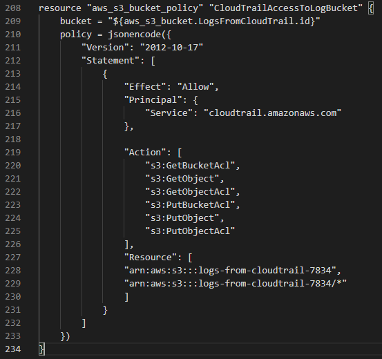
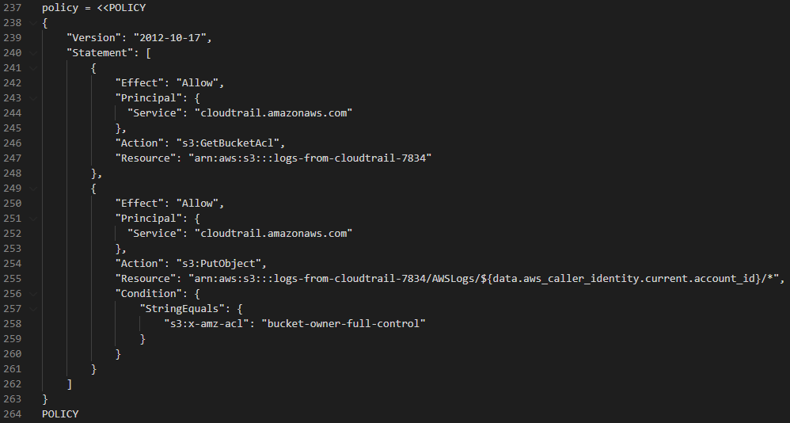

# ASHT
Repo for Account Security Hardening Test (ASHT) code

Main terraform file for Account Security Hardening

Objective:

CloudTrail Requirements:

    1. Enable CloudTrail
        a. Ensure CloudTrail is enabled in all regions
        b. Ensure CloudTrail log file validation is enabled.
        c. Ensure that both management and global events are captured within
        CloudTrail.
        d. Ensure CloudTrail logs are encrypted at rest using KMS customer
        managed CMKs.

    2. Ensure CloudTrail logs are stored within an S3 bucket.
        a. Ensure controls are in place to block public access to the bucket.
        b. Ensure S3 bucket access logging is enabled on the CloudTrail S3 bucket.
    3. Ensure CloudTrail trails are integrated with CloudWatch Logs.

CloudWatch Filters and Alarms Requirements:

    Send an email to a configured email address when any of the following events are
    logged within CloudTrail:

        4. Unauthorized API calls
        5. Management Console sign-in without MFA
        6. Usage of the "root" account

Default VPCs Requirements:

    7. Remove the default VPC within every region of the account.

Completed to 6. Point 4 and 5 are untested, but coded in the same way as point 6
and 6 was tested and works as seen below of alarm email. 

Files:

- main.tf
- SepFiles/

main.tf contains one long file of code to do the above, whereas SepFiles/ contains the same code 
split into smaller sections for readability.

Through the project I have used Trello to keep track of required tasks and made comments about
my usage of resources found, and what resource satisfies the task. Below is the board from the get go:
(Link to [Trello board](https://trello.com/b/RWRYKgFF/account-security-hardening-test))

As you can see, sections are split accoring to CloudTrail Tasks, Cloudwatch, Alarms and Misc (This changes
later into CloudTrails Tasks, CloudWatch Filters and Alarms Requirements, and Default VPCs Requirements
to match the headings from above)

Labels are used to distinguish what type of task and also if they are in progress or completed.

The most upto date version of the board is shown below:

As shown, 7. is still orange, meaning it is still in progress. The issue here is that you cannot easily
delete default VPC/ACLs and I am in the process of working out how to. My temporary fix is deny all inbound
and outbound traffic as explained in the comments on that card.

The main issues I came across in this project was writing the bucket policies to give CloudTrail access to the 
s3 bucket. As seen on the trello board in card (1.) I used a docs.aws resource to help with the content of the 
policy. An example of my attempt before using this is below. 

Comming back to this policy, but embedding it in the S3 bucket, it applies successfully. However, The previous policy,
as seen below, is a better policy as it grants less privileges and also makes sure that the bucket owner, has full control.

Following along with the policies, I have also never used kms modules/resources, and therefore did not know about policies
within the aws_kms_key resource and tried two things before arriving at my current key policy:

- First: Using the aws_kms_grant resource
- Second: Using IAM roles and policies to allow CloudTrail ability to assume the role and use the key

I think these could have worked, but my issue was not giving a user the admin privileges for the key. At the moment the
current user is the key admin, but I do not think this is best practice. I used this [aws resource](https://aws.amazon.com/premiumsupport/knowledge-center/update-key-policy-future/)
to find a working policy, I then adapted the policy for my usage. Such as changing the principal to CloudTrail and
changing the actions to encrypt, decrypt, reencrypt and generateDataKey*.

The next challenge was using the metric filters, especially the pattern for each of: logging in without MFA, unauthorized API
calls and usage of the root account. For finding the correct pattern for each metric filter, I used [Fugue](https://docs.fugue.co/FG_R00055.html),
which gave a step by step for setting the filter and alarm but I used it for the pattern. However the pattern was not the right
syntax and thats where I found this [stackoverflow](https://stackoverflow.com/questions/63668422/getting-invalidparameterexception-while-trying-to-setup-cloudwatch-log-filter-vi) resource to edit the patterns to work.I am not 
100% sure I have set up the filter and alarm correctly, but the root usage works as mentioned earlier, this was done by using 
[this recource](https://docs.fugue.co/FG_R00062.html). At the moment, they are set up to a period of 60s and threshold set to 0.
When the alarm goes into alarm state, this is sent to a SNS topic which a temporary email is subscribed to the topics and therefore 
gets an email notification.