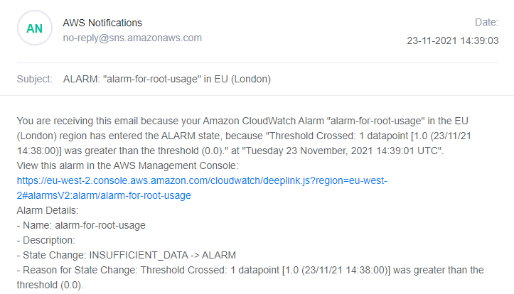

# ASHT
Repo for Account Security Hardening Test (ASHT) code

Main terraform file for Account Security Hardening
Objective:
CloudTrail Requirements:
    1. Enable CloudTrail
        a. Ensure CloudTrail is enabled in all regions
        b. Ensure CloudTrail log file validation is enabled.
        c. Ensure that both management and global events are captured within
        CloudTrail.
        d. Ensure CloudTrail logs are encrypted at rest using KMS customer
        managed CMKs.

    2. Ensure CloudTrail logs are stored within an S3 bucket.
        a. Ensure controls are in place to block public access to the bucket.
        b. Ensure S3 bucket access logging is enabled on the CloudTrail S3 bucket.
    3. Ensure CloudTrail trails are integrated with CloudWatch Logs.

CloudWatch Filters and Alarms Requirements:
    Send an email to a configured email address when any of the following events are
    logged within CloudTrail:
        4. Unauthorized API calls
        5. Management Console sign-in without MFA
        6. Usage of the "root" account

Default VPCs Requirements:
    7. Remove the default VPC within every region of the account.

Fully completed to 6. Point 4 and 5 are untested, but coded in the same way as point 6
and 6 was tested and works. 