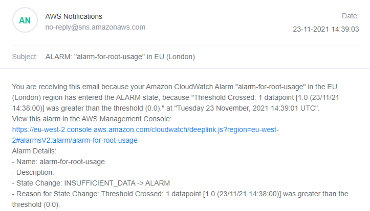
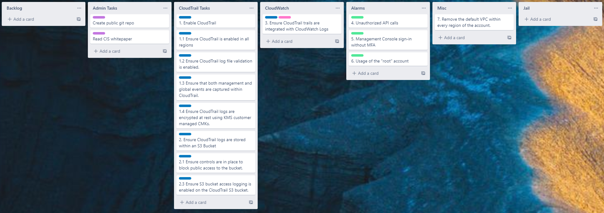
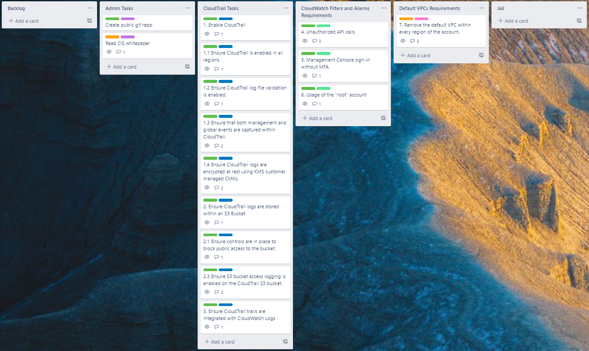

# ASHT
Repo for Account Security Hardening Test (ASHT) code

Main terraform file for Account Security Hardening

Objective:

CloudTrail Requirements:

    1. Enable CloudTrail
        a. Ensure CloudTrail is enabled in all regions
        b. Ensure CloudTrail log file validation is enabled.
        c. Ensure that both management and global events are captured within
        CloudTrail.
        d. Ensure CloudTrail logs are encrypted at rest using KMS customer
        managed CMKs.

    2. Ensure CloudTrail logs are stored within an S3 bucket.
        a. Ensure controls are in place to block public access to the bucket.
        b. Ensure S3 bucket access logging is enabled on the CloudTrail S3 bucket.
    3. Ensure CloudTrail trails are integrated with CloudWatch Logs.

CloudWatch Filters and Alarms Requirements:

    Send an email to a configured email address when any of the following events are
    logged within CloudTrail:

        4. Unauthorized API calls
        5. Management Console sign-in without MFA
        6. Usage of the "root" account

Default VPCs Requirements:

    7. Remove the default VPC within every region of the account.

Fully completed to 6. Point 4 and 5 are untested, but coded in the same way as point 6
and 6 was tested and works as seen below of alarm email. 

Files:

- main.tf
- SepFiles/

main.tf contains one long file of code to do the above, whereas SepFiles/ contains the same code 
split into smaller sections for readability.

Through the project I have used Trello to keep track of required tasks and made comments about
my usage of resources found, and what resource satisfies the task. Below is the board from the get go:
(Link to Trello board: https://trello.com/b/RWRYKgFF/account-security-hardening-test)

As you can see, sections are split accoring to CloudTrail Tasks, Cloudwatch, Alarms and Misc (This changes
later into CloudTrails Tasks, CloudWatch Filters and Alarms Requirements, and Default VPCs Requirements
to match the headings from above)

Labels are used to distinguish what type of task and also if they are in progress or completed.

The most upto date version of the board is shown below:

As shown, 7. is still orange, meaning it is still in progress. The issue here is that you cannot easily
delete default VPC/ACLs and I am in the process of working out how to. My temporary fix is deny all inbound
and outbound traffic as explained in the comments on that card.

